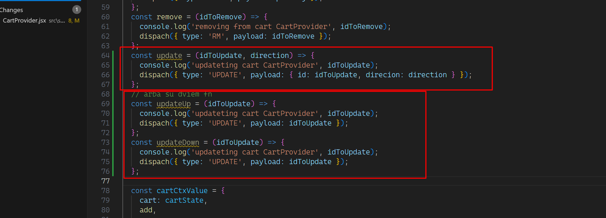
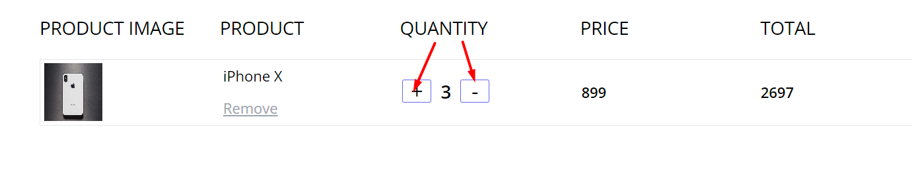
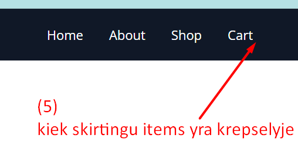
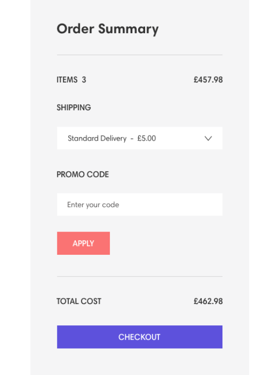
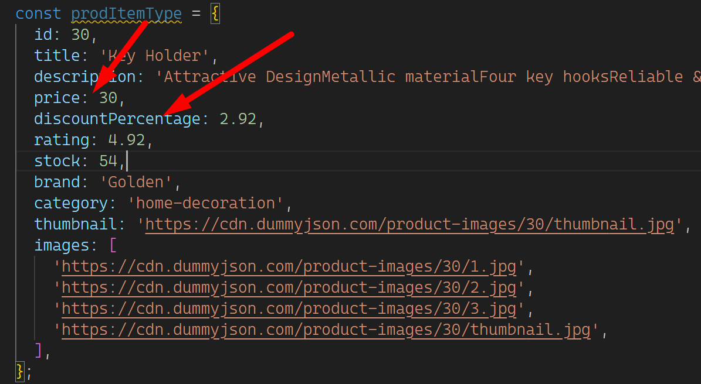

# Steps

## cart Provider

1. update  
2. kiek items krepselyje 
3. add cart summary 

## SingleItemPage

1. kaip cia 
2. apskaiciuoti ir atvaizuoti pilna ir sale kainas 

## SHOP page

1. prideti rikiavimo filtra pagal kaina
2. prideti rikiavimo filtra pagal pasirinkima is select
3. prideti selecta su kategorijos kuris issfiltruoja prekes
