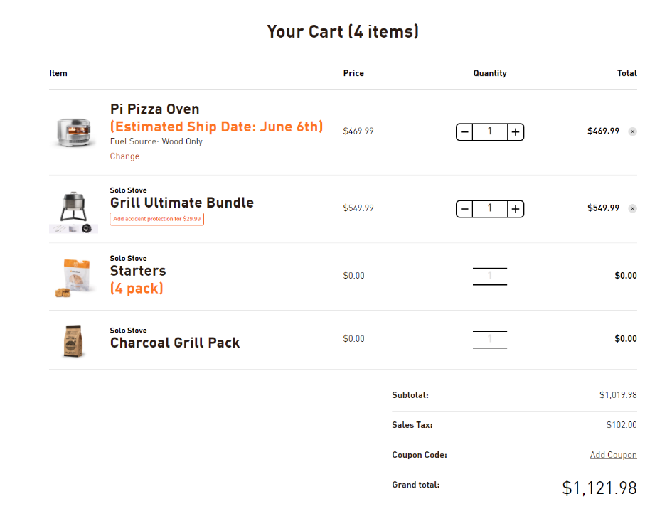
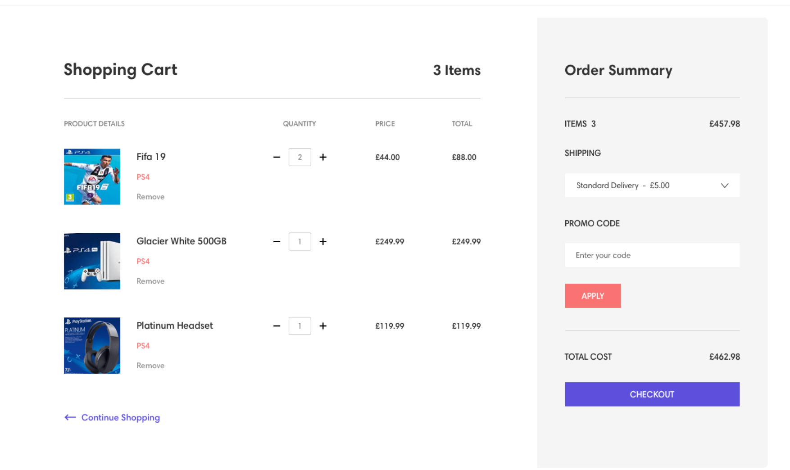

# Shop

## Routes

/ - HomePage
/about - AboutPage
/shop - ShopPage
/shop/5 - ShopItemPage - kurio id yra 5

## Steps

1. suinstaliuoti routeri
2. sukurti routus pagal plana
3. sukurti Headeri
4. ShopPage parsiusti visus itemus is https://dummyjson.com/products (useEffect)

## cart

1. 
2. https://dribbble.com/shots/5311395-Shopping-Cart/attachments/1152094?mode=media 

## Cart item

// atvaizduoti visa cartObj informacija
// inputa su mygtukais + -
// inputo reiksme uzpildoma su qty
// keisti ja su + -

## ShopPAge

1. const addToCard = (itemId) =>
2. ````js
   const removeFromCard = () => {
        // pasalinti objeka is cartArr
      };```
   ````

## SingleItemPage

1. kaip cia 
