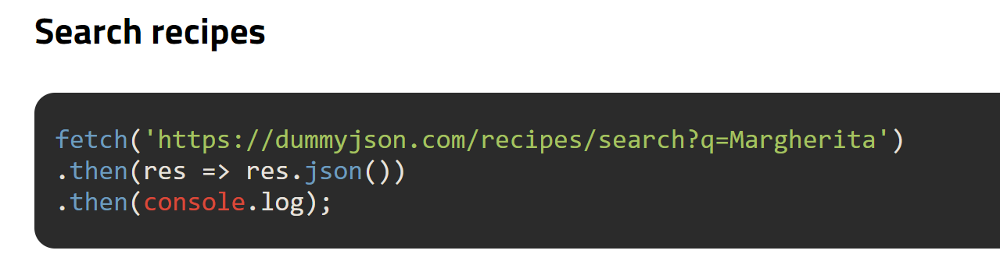

# Practice

sukurti react app su siuo api
https://dummyjson.com/docs/recipes

1. Sukuriam nauja projekta
2. Prisidedam routeri
3. stylinat jums patinkanciu budu.

## pages

1. home - visi receptai, korteliu pavidalu. pasaudus veda i singleReceipie
2. singleReceipie - konkretus receptas
3. recTags - rodo visus receptu tagus is back end korteliu pavidalu. paspaudziami tagai, veda i singleTag psl
4. singleTag - rodo visus receptus konkreciame tage

## search

5. Home page prideti paieskos laukeli ir ieskoti receptu pagal sita 
6. Home page prideti rikiavimo pagal pavadinima mygtuka ir padaryti kad veiktu.
